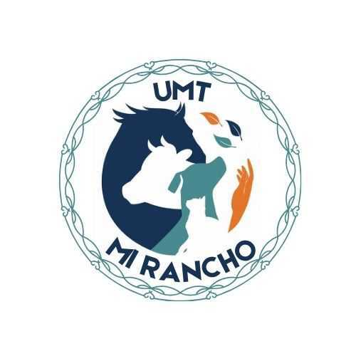

# **🐄 MI RANCHO**

**MI RANCHO** es una plataforma digital diseñada para optimizar la gestión en ranchos, granjas y otras instalaciones que manejan animales. Su objetivo principal es **digitalizar y automatizar el control de cualquier tipo de animal**, permitiendo a los usuarios registrar y monitorear fácilmente la información mediante identificación por chip RFID. Esta solución reemplaza los métodos tradicionales en papel, mejorando la eficiencia y precisión en la administración de datos, además de facilitar el acceso a información clave en tiempo real.

## **🔍 Descripción del Proyecto**

**MI RANCHO** es una solución digital integral diseñada para facilitar la gestión y seguimiento de animales en diversas instalaciones, como ranchos, granjas, zoológicos y refugios. El software permite a los usuarios **registrar, monitorizar y gestionar información clave** sobre los animales de manera eficiente y segura.

La plataforma está orientada a sustituir los tradicionales registros en papel, ofreciendo una **gestión digital automatizada** que incluye la identificación de cada animal mediante tecnología **RFID (Identificación por Radiofrecuencia)**. Esto facilita el seguimiento individual de los animales, proporcionando un historial completo de su salud, alimentación y productividad, todo accesible desde un dispositivo móvil.

### **¿Para qué sirve? 🤔**
El software permite a los usuarios:
- **🐖 Registrar y gestionar animales** de diferentes especies, ya sea ganado, aves, caballos, mascotas, etc.
- **🔍 Identificar animales mediante chips RFID**, lo que asegura un seguimiento más preciso y menos propenso a errores.
- **📜 Mantener un historial completo de cada animal**, incluyendo datos sobre su salud, alimentación, reproducción y otros aspectos importantes.
- **📊 Generar informes personalizados** que ayuden a tomar decisiones basadas en datos sobre la productividad, salud y bienestar de los animales.
- **🌐 Sincronización en tiempo real** para que los datos siempre estén actualizados y accesibles desde cualquier lugar.

### **¿A quién está dirigido? 🎯**
Este software está dirigido a:
- **👨‍🌾 Ganaderos y administradores de ranchos** que buscan digitalizar la gestión de ganado, reduciendo la carga administrativa.
- **🌱 Dueños y gerentes de granjas** que necesitan una herramienta efectiva para gestionar animales de diversas especies.
- **🐾 Veterinarios y personal de zoológicos** interesados en llevar un control detallado de la salud y bienestar de los animales.
- **🏠 Refugios de animales** que desean un método eficiente para gestionar grandes volúmenes de animales, facilitando el seguimiento individual.

## **💡 Motivación**

El proyecto **"Mi Rancho"** se creó en respuesta a los desafíos significativos que enfrentan los profesionales en la gestión de animales en diversas industrias. La gestión tradicional basada en papel presenta varios problemas que afectan tanto la eficiencia como la efectividad en el manejo de los animales. 

### **Problemas que estamos resolviendo:**
1. **⏳ Ineficiencia en la gestión de datos**: Los registros en papel son propensos a errores, difíciles de actualizar y pueden resultar en la pérdida de información crucial. La falta de acceso inmediato a la información puede causar retrasos en la toma de decisiones.

2. **🐄 Dificultades en el seguimiento individual**: Sin una herramienta adecuada, el seguimiento del estado de salud, alimentación y otros aspectos de cada animal se vuelve complicado, especialmente en instalaciones con un gran número de animales.

3. **🐕 Falta de visibilidad en la salud y bienestar animal**: La incapacidad de tener un historial claro y accesible sobre la salud y el comportamiento de los animales puede llevar a problemas de bienestar y productividad, lo que a su vez afecta a la rentabilidad de la operación.

4. **📉 Limitaciones en el acceso a información**: Los métodos tradicionales no permiten el acceso a datos en tiempo real, lo que dificulta la toma de decisiones informadas y oportunas.

### **Importancia del Proyecto:**
- **🔧 Eficiencia y precisión**: Al digitalizar el registro y seguimiento de los animales, **"Mi Rancho"** mejora la eficiencia operativa, reduce la carga administrativa y minimiza errores, lo que resulta en una mejor gestión de los recursos.

- **🐾 Bienestar animal**: Proporcionar a los propietarios y administradores acceso fácil a la información sobre la salud y el estado de cada animal contribuye a mejorar su bienestar y calidad de vida.

- **📊 Decisiones basadas en datos**: Al facilitar la recopilación y análisis de datos, los usuarios pueden tomar decisiones más informadas, lo que puede llevar a una mejora en la productividad y rentabilidad del negocio.

- **🤝 Facilitación del trabajo en equipo**: Al permitir que varios usuarios accedan y colaboren en la gestión de datos, **"Mi Rancho"** fomenta una mejor comunicación y cooperación entre los miembros del equipo, mejorando la dinámica de trabajo.

##**🎯 Objetivos**
Aquí tienes una lista de los **objetivos clave** que el proyecto **"Mi Rancho"** busca alcanzar:

### **Objetivos de "Mi Rancho"**
1. **💻 Digitalizar el seguimiento y registro de animales**: Implementar una plataforma que reemplace los registros en papel, permitiendo a los usuarios llevar un control digital eficiente de todos los animales.

2. **📡 Implementar identificación mediante chips RFID**: Facilitar la identificación única de cada animal a través de tecnología RFID, mejorando la precisión en el seguimiento y la gestión de datos.

3. **📂 Centralizar la información de salud y alimentación**: Crear un historial accesible y organizado de la salud, alimentación y comportamiento de cada animal, lo que permite un mejor cuidado y bienestar.

4. **📈 Generar informes personalizados**: Ofrecer la capacidad de crear informes detallados sobre la producción, estado de salud y otros datos relevantes, facilitando la toma de decisiones informadas.

5. **📱 Facilitar el acceso a datos en tiempo real**: Permitir a los usuarios acceder a información actualizada desde cualquier lugar y en cualquier momento, mejorando la capacidad de respuesta ante cualquier situación.

6. **🤝 Mejorar la colaboración y comunicación del equipo**: Fomentar un entorno de trabajo colaborativo donde todos los miembros del equipo puedan acceder y compartir información relevante, mejorando la coordinación en la gestión animal.

7. **⏱️ Aumentar la eficiencia operativa**: Reducir el tiempo y esfuerzo dedicado a la administración de datos, permitiendo a los usuarios concentrarse en otras áreas críticas de su operación.

8. **🐾 Contribuir al bienestar animal**: Asegurar que cada animal reciba el cuidado adecuado a través de un seguimiento constante y accesible, lo que ayuda a mejorar su salud y calidad de vida.

## **🔑 Funcionalidades Principales**
- **📋 Registro de animales**: Los usuarios pueden registrar y gestionar la información de los animales.
- **📡 Identificación por chip**: Soporte para identificar cada animal mediante tecnología RFID.
- **🩺 Historial de salud y alimentación**: Almacena y organiza los datos relacionados con la salud y dieta de cada animal.
- **📊 Informes personalizados**: Generación de informes sobre la producción, estado de los animales, etc.

## **🔍 Requerimientos Funcionales**

1. **📱 Aplicación Móvil**  
   La aplicación debe estar disponible para dispositivos móviles (Android e iOS), permitiendo a los usuarios acceder a la plataforma desde sus teléfonos o tabletas. Esto proporciona mayor flexibilidad y acceso en tiempo real a la información del ganado, sin depender de una computadora.

2. **🌐 Offline/Online**  
   - **Modo Offline**: Los usuarios podrán registrar y consultar la información básica de los animales y sus características, incluso en áreas sin cobertura de internet. Los datos se almacenarán localmente en el dispositivo.
   - **Modo Online**: Cuando el dispositivo esté conectado a internet, la aplicación sincronizará automáticamente la información registrada mientras estaba offline con la base de datos en la nube, actualizándose con cualquier cambio realizado por otros usuarios autorizados.

3. **🐄 Añadir Animales y Características (Salud, Descendencia, Registros)**  
   - **Registro de Animales**: La aplicación debe permitir al usuario agregar nuevos animales con detalles específicos, tales como:
     - **Identificación** (nombre o número de referencia).
     - **Información demográfica** (raza, edad, género, fecha de nacimiento).
     - **Características Físicas**: Peso, tamaño, color y otros detalles visuales.
   - **Salud**: Los usuarios podrán registrar y consultar el historial de salud de cada animal, incluyendo:
     - Vacunaciones.
     - Enfermedades y tratamientos.
     - Exámenes médicos.
   - **Descendencia**: Registrar información sobre la descendencia, asociando crías con los padres y permitiendo un seguimiento de la genealogía.
   - **Registros Adicionales**: Añadir eventos importantes como inseminación, nacimientos, sacrificios o ventas de animales, para mantener un control completo del ciclo de vida de cada ejemplar.

4. **📡 Rastreo y Reconocimiento RFID**  
   La aplicación deberá integrar la tecnología de identificación por radiofrecuencia (RFID), permitiendo a los usuarios rastrear e identificar animales mediante dispositivos de lectura RFID.
   - **Rastreo de Animales**: Los usuarios podrán escanear las etiquetas RFID que lleven los animales para obtener información inmediata sobre su estado de salud, ubicación y otros datos relevantes.
   - **Actualización Automática**: Al leer la etiqueta RFID de un animal, se actualizará automáticamente la información de dicho ejemplar en la base de datos de la aplicación.

## **🔒 Requerimientos No Funcionales**

1. **🔄 Disponibilidad**  
   La aplicación debe garantizar una alta disponibilidad, permitiendo a los usuarios acceder a sus funciones (registro de animales, consultas, etc.) en todo momento. El sistema en la nube debe estar disponible al menos el **99.9%** del tiempo, minimizando periodos de inactividad.

2. **📈 Escalabilidad**  
   La aplicación debe ser capaz de manejar un número creciente de usuarios y animales sin afectar el rendimiento. Debe ser posible gestionar desde pequeños rebaños hasta grandes cantidades de ganado (decenas de miles de registros) sin pérdida de rendimiento.

3. **⚡ Rendimiento**  
   - **Rápida respuesta en modo offline**: El acceso a los datos debe ser inmediato en modo offline.
   - **Sincronización eficiente**: Al volver a modo online, los datos recopilados en offline deben sincronizarse rápidamente, con una carga mínima de ancho de banda.
   - **Lectura RFID**: El reconocimiento de animales mediante RFID debe ser instantáneo, sin retrasos notables, incluso en condiciones de señal variables.

4. **🔐 Seguridad**  
   La información debe estar protegida tanto localmente en el dispositivo como en la nube:
   - **Encriptación** de los datos almacenados localmente y durante la transmisión para garantizar que la información no sea vulnerable a ataques.
   - **Autenticación de usuarios** mediante contraseñas seguras o autenticación biométrica para evitar el acceso no autorizado.
   - Implementación de **roles de usuario** para limitar las acciones que diferentes usuarios pueden realizar (por ejemplo, un trabajador de campo podría registrar información, pero no modificar datos críticos del sistema).

5. **🖥️ Usabilidad**  
   La interfaz debe ser intuitiva y fácil de usar, permitiendo que personas con conocimientos técnicos básicos puedan utilizarla sin dificultades. El proceso para añadir animales o actualizar características debe ser rápido y simple, con el mínimo número de pasos necesario. Debe incluir instrucciones claras y tutoriales para facilitar el aprendizaje de las funciones clave, como el escaneo RFID y la sincronización de datos.

6. **📱 Portabilidad**  
   La aplicación debe ser compatible con una amplia gama de dispositivos móviles con diferentes tamaños de pantalla y sistemas operativos, como Android e iOS, adaptándose automáticamente a las resoluciones de pantalla. Además, debe funcionar eficientemente en dispositivos de gama media o baja, optimizando el uso de recursos como la memoria y el procesador.

7. **🔧 Mantenimiento**  
   El sistema debe ser fácil de mantener, permitiendo actualizaciones regulares sin afectar la funcionalidad. La aplicación debe poder autodescargarse actualizaciones, tanto de la aplicación misma como de la base de datos, sin requerir intervención manual del usuario.

8. **✅ Confiabilidad**  
   La aplicación debe ser lo suficientemente robusta para evitar la pérdida de datos en situaciones de uso prolongado en modo offline. La sincronización de datos debe manejar conflictos y duplicados de forma eficiente y precisa. En caso de fallas o interrupciones durante la sincronización, la aplicación debe tener mecanismos de recuperación de datos automáticos para evitar pérdidas.

9. **⏱️ Tiempo de Carga**  
   El tiempo de inicio de la aplicación debe ser corto, idealmente menos de **5 segundos** en la mayoría de los dispositivos. Las funciones clave, como el registro y la consulta de datos, deben cargarse de manera rápida, para que los usuarios no experimenten retrasos.

Aquí tienes la ampliación del documento con un apartado de artefactos y otro de priorización, manteniendo el uso de emojis para hacerlo más atractivo:

## **🛠️ Artefactos**

1. **📄 Documentación de Requerimientos**  
   Un documento que reúne todos los requerimientos funcionales y no funcionales, sirviendo como guía para el desarrollo y validación de la aplicación.

2. **🎨 Prototipos de Interfaz de Usuario (UI)**  
   Prototipos visuales que ilustran el diseño y la disposición de la interfaz de la aplicación, permitiendo a los usuarios y desarrolladores tener una visión previa de cómo lucirá la aplicación.

3. **🔄 Especificaciones Técnicas**  
   Un documento que detalla las tecnologías, frameworks y arquitecturas que se utilizarán en el desarrollo de la aplicación, así como las decisiones de diseño técnico.

4. **📊 Plan de Pruebas**  
   Un plan que describe los tipos de pruebas que se realizarán (unitarias, integración, sistema, etc.) y los criterios de aceptación para asegurar que la aplicación cumple con los requerimientos.

5. **📈 Informe de Progreso**  
   Informes regulares que resumen el avance del proyecto, los logros alcanzados y los desafíos encontrados durante el desarrollo, facilitando la comunicación entre el equipo y los stakeholders.

6. **🛠️ Manual de Usuario**  
   Un documento que proporciona instrucciones claras sobre cómo utilizar la aplicación, incluyendo funciones clave y solución de problemas comunes.

## **📊 Priorización**

La priorización de requerimientos es crucial para asegurar que se aborden primero las funcionalidades más importantes. A continuación se detalla un enfoque de priorización basado en la metodología MoSCoW:

1. **💯 Must Have (Debe Tener)**  
   Requerimientos esenciales que son imprescindibles para que la aplicación funcione correctamente:
   - Aplicación móvil disponible para Android e iOS.
   - Registro de animales y características.
   - Modo offline y online con sincronización.

2. **✨ Should Have (Debería Tener)**  
   Requerimientos que son importantes, pero no críticos para el lanzamiento inicial:
   - Rastreo y reconocimiento RFID.
   - Registros adicionales (inseminación, nacimientos, etc.).
   - Interface intuitiva y fácil de usar.

3. **🔄 Could Have (Podría Tener)**  
   Funcionalidades que agregarían valor, pero pueden ser implementadas en futuras versiones:
   - Integración de gráficos o estadísticas sobre el ganado.
   - Notificaciones para recordatorios de vacunaciones o tratamientos.
   - Funcionalidades sociales, como compartir información con otros usuarios.

4. **❌ Won't Have (No Tendrá)**  
   Requerimientos que no se implementarán en esta fase del proyecto, pero que podrían ser considerados para versiones futuras:
   - Integración con dispositivos de monitoreo de salud en tiempo real.
   - Funcionalidad de comercio electrónico para la venta de ganado.

## **🌍 Competencias Genéricas**

1. **🔍 Pensamiento Crítico**  
   Capacidad para analizar problemas y desarrollar soluciones efectivas, lo que es crucial para abordar desafíos en la gestión de datos y la integración de tecnologías como RFID.

2. **🤝 Trabajo en Equipo**  
   Habilidad para colaborar con miembros de diferentes disciplinas, fomentando la comunicación y la cooperación para lograr los objetivos del proyecto.

3. **📊 Gestión del Tiempo**  
   Capacidad para planificar y priorizar tareas, asegurando que el desarrollo del producto cumpla con los plazos establecidos y se mantenga en línea con el cronograma del proyecto.

4. **💻 Adaptabilidad**  
   Flexibilidad para adaptarse a cambios en requisitos o tecnologías, lo que permite al equipo ajustarse a nuevas demandas del proyecto o del mercado.

5. **📈 Orientación a Resultados**  
   Enfoque en la consecución de objetivos y metas específicas, evaluando continuamente el progreso del proyecto y tomando decisiones informadas para mejorar los resultados.

## **🎯 Competencias Específicas**

1. **🛠️ Desarrollo de Software**  
   Conocimiento en lenguajes de programación (como Dart) y plataformas (como Flutter) para diseñar y construir una aplicación móvil funcional y eficiente.

2. **📊 Análisis de Datos**  
   Habilidad para recopilar, interpretar y presentar datos de manera que se traduzcan en decisiones informadas sobre la salud y el manejo del ganado.

3. **🔐 Seguridad Informática**  
   Competencia en la implementación de medidas de seguridad para proteger la información sensible de los usuarios y los animales, incluyendo encriptación y autenticación.

4. **📱 Desarrollo de Aplicaciones Móviles**  
   Experiencia en la creación de interfaces de usuario intuitivas y amigables, asegurando que la aplicación sea fácil de usar para los ganaderos y administradores.

5. **🌐 Integración de Tecnología RFID**  
   Conocimiento en la implementación y uso de tecnología de identificación por radiofrecuencia para el seguimiento y gestión de animales, mejorando la eficiencia en la administración del ganado.

6. **📈 Gestión de Proyectos**  
   Capacidad para aplicar metodologías ágiles, como Scrum, para gestionar el desarrollo del producto, asegurando que el equipo cumpla con los plazos y requisitos del cliente.

## 📋 Descripción del Proceso

El proceso de desarrollo del software "Mi Rancho" se basa en la metodología **Scrum**, que permite una gestión ágil y eficiente del proyecto. Cada **sprint** tiene una duración de una semana, donde se definen tareas específicas y se realizan entregas parciales del producto. Este enfoque permite adaptarse rápidamente a los cambios y mejorar continuamente el software basado en la retroalimentación del equipo y de los usuarios finales. 🐄✨

## 📈 Gestión del Proceso

La gestión del proceso se realiza a través de **Slack**, donde el equipo de 5 personas se comunica de manera efectiva. Se utilizan herramientas de seguimiento de tareas para asegurarse de que cada miembro del equipo esté alineado con los objetivos del sprint. Las reuniones diarias de **scrum** son clave para coordinar esfuerzos, identificar obstáculos y celebrar logros. 🛠️🤝

## 📊 Métrica de Contribución Individual

Cada miembro del equipo tiene responsabilidades específicas en el desarrollo del proyecto. Las métricas de contribución se basan en el cumplimiento de tareas asignadas, la calidad del trabajo realizado y la capacidad de colaborar en equipo. Se evalúa el rendimiento mediante el seguimiento del avance en los sprints y se fomenta la retroalimentación continua para el crecimiento profesional de cada integrante. 📅🌟

## 🗂️ Organización y Documentación del Repositorio

El repositorio del proyecto "Mi Rancho" está organizado de manera estructurada para facilitar el acceso a la documentación y al código fuente. Se utilizan convenciones de nomenclatura clara y se incluyen **README** detallados en cada módulo del software. Además, se mantiene un registro de las decisiones tomadas y los cambios realizados en el proyecto, asegurando así una documentación completa y actualizada. 📚💻

## **👥 Equipo de "Mi Rancho"**
- **BrayanMaldonado-coder** - Desarrollador principal
- **Cynthia356384** - Especialista en UX/UI
- **Jose-Meza1206** - Tester y encargado de la documentación
- **jazminfern4ndez** - Área administrativa
- **MichelleFirst** - Control de calidad

## **🛠️ Roles de Scrum**
- **Product Owner**: jazminfern4ndez  
- **Scrum Master**: MichelleFirst 
- **Development Team**:
  - Jose-Meza1206
  - Cynthia356384
  - BrayanMaldonado-coder

## **💻 Tecnologías Utilizadas**
- **Frontend y Backend**: **Flutter** 
- **Lenguaje de programación**: Dart
- **Identificación**: Integración con hardware RFID para identificación de los animales.
- **Base de datos**: Firebase 
- **Otros**: APIs para la sincronización de datos y generación de informes.

## **📊 Estado del Proyecto**
El proyecto **"Mi Rancho"** se encuentra actualmente en la fase de **planificación y diseño**. Hasta ahora, se han definido los **requisitos funcionales y no funcionales**, lo que proporciona una base sólida para el desarrollo del software.

### **Detalles del Estado Actual:**
- **📝 Requisitos Definidos**: 
  - Los requisitos funcionales describen las características y funcionalidades que el software debe ofrecer, como el registro de animales, la identificación por chip, y la generación de informes.
  - Los requisitos no funcionales abordan aspectos como la seguridad, rendimiento y usabilidad, asegurando que el sistema no solo cumpla con las funciones requeridas, sino que también sea eficiente y fácil de usar.

- **📅 Próximos Pasos**: 
  - La próxima fase implica el inicio de la codificación, donde el equipo de desarrollo comenzará a implementar las funcionalidades definidas en los requisitos. 
  - Se llevará a cabo una serie de reuniones de planificación y revisión para asegurarse de que el desarrollo siga alineado con la visión del proyecto.

## Presentación del Avance 📊

Los avances del proyecto "Mi Rancho" se presentan de manera semanal mediante exposiciones y diapositivas. Este formato permite a todos los miembros del equipo compartir sus logros, discutir los desafíos encontrados y recibir retroalimentación constructiva. Cada presentación incluye:

- **Diapositivas** que resumen el trabajo realizado en la semana.
- **Exposición verbal** para explicar los detalles de cada tarea y su impacto en el proyecto.
- **Discusión** para abordar preguntas y sugerencias de los compañeros.

## **📞 Contacto**
Para mantenerte en contacto con el equipo y otros interesados en el proyecto **"Mi Rancho"**, puedes unirte a nuestro canal de Slack utilizando la siguiente ID de canal:

- **ID del Canal de Slack**: **C07PQ5NE7NH**

### **Pasos para unirte al canal**:
1. **Abre Slack**: Inicia la aplicación de Slack o accede a la versión web.
2. **Unirse al Canal**:
   - En la barra lateral izquierda, busca la opción "Canales" o "Channels".
   - Haz clic en "Unirse a un canal" o "Browse channels".
   - En la barra de búsqueda, ingresa la ID del canal: **C07PQ5NE7NH**.
   - Selecciona el canal y haz clic en "Unirse" o "Join".

