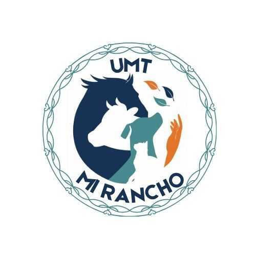

# 🐄 MI RANCHO

> Plataforma digital para la gestión y seguimiento de animales mediante tecnología RFID.

---

## 📌 Descripción del proyecto

**Mi Rancho** es una propuesta de aplicación móvil diseñada para facilitar la gestión y seguimiento de animales en ranchos, granjas, zoológicos y refugios.

El proyecto busca sustituir los registros tradicionales en papel mediante una solución digital que permita centralizar información relacionada con los animales, incluyendo datos de identificación, salud, alimentación, reproducción y productividad.

Uno de los principales componentes de la propuesta es la utilización de **tecnología RFID (Identificación por Radiofrecuencia)** para facilitar la identificación individual de los animales y el acceso a su información.

La aplicación está pensada para proporcionar información organizada y accesible, incluyendo escenarios de trabajo **offline y online**, con sincronización de datos cuando exista conexión a Internet.

---

## 🎯 Objetivo

Desarrollar una solución digital que facilite la administración de animales y permita a los usuarios:

- 🐄 Registrar animales y sus características.
- 📡 Identificar animales mediante RFID.
- 🩺 Consultar historiales de salud y alimentación.
- 🧬 Registrar información relacionada con reproducción y descendencia.
- 📊 Generar informes personalizados.
- 📱 Acceder a información desde dispositivos móviles.
- 🔄 Trabajar en modo offline y sincronizar posteriormente los datos.
- 🤝 Facilitar la colaboración entre los miembros del equipo encargado de la gestión.

---

## 💡 Problema que busca resolver

La gestión tradicional mediante registros en papel puede dificultar:

- La actualización de información.
- El seguimiento individual de cada animal.
- El acceso rápido a historiales.
- La organización de grandes cantidades de información.
- La disponibilidad de datos en tiempo real.

**Mi Rancho** plantea una alternativa digital para centralizar esta información y facilitar su consulta y administración.

---

# ✨ Funcionalidades principales

### 🐄 Gestión de animales

- Registro de animales.
- Identificación mediante nombre, número o referencia.
- Registro de raza, edad, género y fecha de nacimiento.
- Registro de características físicas como peso, tamaño y color.

### 🩺 Historial de salud

- Registro de vacunaciones.
- Registro de enfermedades.
- Registro de tratamientos.
- Registro de exámenes médicos.
- Consulta del historial de cada animal.

### 🧬 Reproducción y descendencia

- Registro de descendencia.
- Asociación entre padres y crías.
- Seguimiento de genealogía.
- Registro de eventos relacionados con reproducción.

### 📡 Identificación mediante RFID

La aplicación contempla la integración con lectores RFID para identificar animales y consultar su información de manera rápida.

### 📊 Informes

Se contempla la generación de informes relacionados con:

- Producción.
- Estado de los animales.
- Salud.
- Información relevante para la gestión.

### 📱 Aplicación móvil

El proyecto está diseñado como una aplicación móvil para dispositivos Android e iOS.

### 🔄 Modo Offline / Online

La propuesta contempla:

- **Modo Offline:** registrar y consultar información sin conexión.
- **Modo Online:** sincronizar los datos almacenados cuando vuelva a existir conexión.

---

# 🛠️ Tecnologías utilizadas

| Tecnología | Uso |
|---|---|
| **Flutter** | Desarrollo de la aplicación |
| **Dart** | Lenguaje de programación |
| **Firebase** | Base de datos y servicios en la nube |
| **RFID** | Identificación de animales |
| **APIs** | Sincronización y generación de informes |
| **Git / GitHub** | Control y organización del proyecto |

---

# 🎨 Mi participación — Cynthia356384

## UX/UI y Diseño Visual

Mi principal responsabilidad dentro de **Mi Rancho** fue desarrollar la parte gráfica y visual del proyecto, enfocándome en la experiencia de usuario y en la organización de la interfaz.

### Mis responsabilidades

- 🎨 Diseño de la interfaz de usuario.
- 🖥️ Diseño y organización visual de las pantallas.
- ✨ Desarrollo de la propuesta gráfica.
- 👤 Diseño de la experiencia de usuario (UX).
- 📐 Organización de los elementos visuales de la aplicación.
- 📱 Diseño de una interfaz clara, funcional y fácil de utilizar.
- 🤝 Colaboración con el equipo para alinear el diseño con las necesidades del proyecto.

Mi objetivo dentro del equipo fue contribuir a que **Mi Rancho** tuviera una interfaz clara, funcional y orientada a las necesidades de los usuarios.

---

# 👥 Equipo y contribuciones

El proyecto fue desarrollado mediante trabajo colaborativo entre los integrantes del equipo.

### 🎨 Cynthia356384 — UX/UI y Diseño Visual

- Responsable del diseño de interfaz y experiencia de usuario.
- Desarrollo de la propuesta gráfica.
- Organización visual de las pantallas.
- Diseño de la experiencia de usuario.
- Participación en el equipo de desarrollo.

### 📋 jazminfern4ndez — Área Administrativa

- Participación en el área administrativa.
- Apoyo en la organización y seguimiento del proyecto.
- Participación en la gestión de las actividades del equipo.
- Responsabilidades relacionadas con la organización administrativa.

### 💻 BrayanMaldonado-coder — Desarrollo

- Responsable principal del desarrollo.
- Participación en la implementación de la solución.
- Trabajo relacionado con la construcción de la aplicación.
- Participación en las actividades del equipo de desarrollo.

### 🧪 Jose-Meza1206 — Testing y Documentación

- Realización de pruebas del proyecto.
- Identificación y seguimiento de posibles problemas.
- Elaboración y organización de documentación.
- Apoyo en la validación de los requerimientos.

### ✅ MichelleFirst — Control de Calidad

- Revisión de la calidad del proyecto.
- Seguimiento del cumplimiento de los requerimientos.
- Apoyo en la validación del producto.
- Participación en actividades relacionadas con el control de calidad.

---

# 🔄 Metodología de trabajo

El desarrollo del proyecto se plantea utilizando la metodología **Scrum**.

El equipo trabaja mediante **sprints de una semana**, en los cuales se establecen tareas, se revisan avances y se identifican problemas durante el desarrollo.

Para la comunicación y coordinación del equipo se utiliza **Slack**.

### Roles de Scrum

- **Product Owner:** jazminfern4ndez
- **Scrum Master:** MichelleFirst
- **Development Team:**
  - BrayanMaldonado-coder
  - Cynthia356384
  - Jose-Meza1206

---

# 📋 Requerimientos funcionales

La propuesta contempla las siguientes funcionalidades:

1. Aplicación móvil para Android e iOS.
2. Registro de animales y sus características.
3. Funcionamiento offline y online.
4. Sincronización de información.
5. Identificación mediante RFID.
6. Registro de salud y alimentación.
7. Registro de reproducción y descendencia.
8. Registro de eventos importantes.
9. Generación de informes.
10. Acceso a información desde dispositivos móviles.

---

# 🔒 Requerimientos no funcionales

El proyecto contempla los siguientes aspectos:

- 🔄 Disponibilidad.
- 📈 Escalabilidad.
- ⚡ Rendimiento.
- 🔐 Seguridad.
- 🖥️ Usabilidad.
- 📱 Portabilidad.
- 🔧 Mantenimiento.
- ✅ Confiabilidad.
- ⏱️ Tiempos de carga reducidos.

---

# 🔐 Seguridad

La propuesta contempla diferentes mecanismos para proteger la información:

- Encriptación de datos.
- Autenticación de usuarios.
- Roles y permisos.
- Protección de información almacenada localmente y en la nube.

El sistema contempla diferentes niveles de acceso dependiendo de las responsabilidades de cada usuario.

---

# 📱 Experiencia de usuario

Uno de los objetivos del proyecto es desarrollar una interfaz intuitiva para usuarios con diferentes niveles de conocimiento tecnológico.

La aplicación contempla procesos simples para:

- Registrar animales.
- Consultar información.
- Actualizar características.
- Escanear identificadores RFID.
- Consultar historiales.
- Sincronizar información.

La propuesta busca reducir la cantidad de pasos necesarios para realizar las tareas principales.

---

# 📊 Priorización del proyecto

La priorización de funcionalidades se plantea mediante la metodología **MoSCoW**.

### 🔴 Must Have

Funcionalidades esenciales:

- Aplicación móvil.
- Registro de animales.
- Registro de características.
- Funcionamiento offline/online.
- Sincronización de datos.

### 🟡 Should Have

Funcionalidades importantes:

- Reconocimiento RFID.
- Registros de reproducción.
- Interfaz intuitiva y fácil de utilizar.

### 🟢 Could Have

Funcionalidades para futuras versiones:

- Gráficas y estadísticas.
- Notificaciones para vacunaciones y tratamientos.
- Funcionalidades para compartir información.

### ⚪ Won't Have

Funcionalidades que no forman parte de esta etapa:

- Integración con dispositivos de monitoreo de salud en tiempo real.
- Comercio electrónico para venta de ganado.

---

# 📚 Artefactos del proyecto

Durante la planificación del proyecto se contemplan diferentes artefactos:

- 📄 Documentación de requerimientos.
- 🎨 Prototipos de interfaz de usuario.
- 🔧 Especificaciones técnicas.
- 🧪 Plan de pruebas.
- 📈 Informes de progreso.
- 📖 Manual de usuario.

---

# 🧠 Competencias desarrolladas

Durante el desarrollo del proyecto se trabajan diferentes competencias:

- 🔍 Pensamiento crítico.
- 🤝 Trabajo en equipo.
- 📅 Gestión del tiempo.
- 💻 Adaptabilidad.
- 📈 Orientación a resultados.
- 🎨 Diseño de interfaces.
- 👤 Experiencia de usuario.
- 🧪 Pruebas y control de calidad.
- 📋 Gestión de proyectos.
- 🔄 Trabajo con metodología Scrum.

---

# 📈 Estado actual del proyecto

> 🟡 **Proyecto en fase de planificación y diseño**

Actualmente se encuentran definidos los requerimientos funcionales y no funcionales del sistema.

La siguiente etapa contempla comenzar con la implementación de las funcionalidades definidas.

---

# 🚀 Próximos pasos

Entre las siguientes etapas del proyecto se contempla:

1. Iniciar la implementación de la aplicación.
2. Desarrollar las interfaces diseñadas.
3. Implementar la gestión de animales.
4. Integrar Firebase.
5. Trabajar en la integración RFID.
6. Implementar el funcionamiento offline/online.
7. Realizar pruebas.
8. Validar las funcionalidades.
9. Mejorar la experiencia de usuario.
10. Preparar la presentación final del proyecto.

---

# 🗂️ Organización y documentación

El repositorio busca mantener una estructura organizada para facilitar:

- Acceso al código.
- Documentación del proyecto.
- Seguimiento de cambios.
- Organización de módulos.
- Registro de decisiones.
- Trabajo colaborativo.

---

# 🤝 Trabajo colaborativo

El proyecto se desarrolla mediante colaboración entre los integrantes del equipo.

La organización de tareas, comunicación y seguimiento de avances permite distribuir responsabilidades entre las diferentes áreas del proyecto.

---

# 📞 Contacto

### Proyecto

**Mi Rancho**

Repositorio:

---

# 👩‍💻 Cynthia356384

**UX/UI Designer | Diseño Visual | Desarrollo de proyectos**

Participación en **Mi Rancho** enfocada principalmente en:

- 🎨 Diseño visual.
- 📱 Diseño de interfaces.
- 👤 Experiencia de usuario.
- 📐 Organización visual.
- 🤝 Trabajo colaborativo.

---

⭐ **Mi Rancho — Gestión digital para el seguimiento y administración de ganado.**

